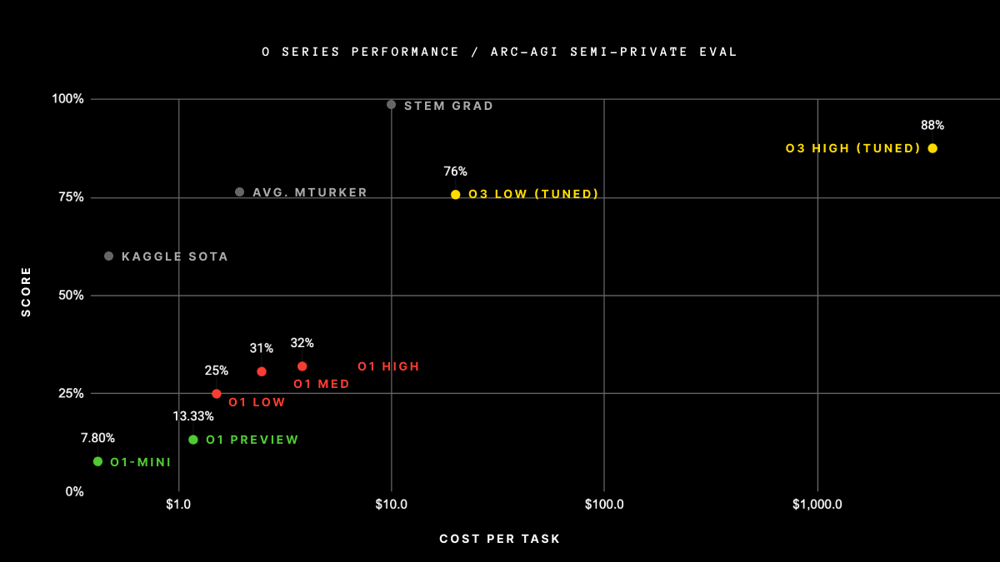
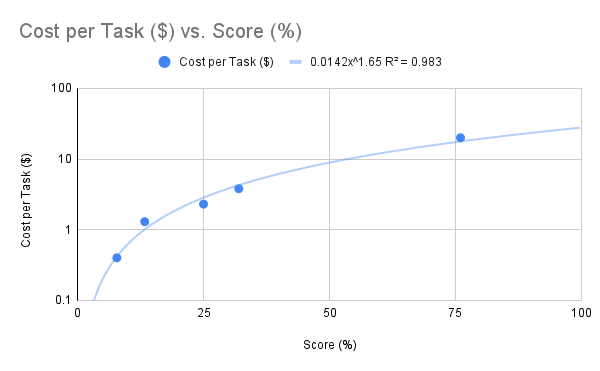

This week OpenAI announced their O3 model, which posts some impressive numbers on the [ARC-AGI benchmark](https://arcprize.org/blog/oai-o3-pub-breakthrough). However, while these results are impressive, they come with a sizeable price tag. We discuss what this means for the current generation of AI agents and the goal of achieving human level performance on tasks requiring complex reasoning.

---

## Introduction

This week OpenAI announced their O3 model, which boasts a new high score on the [ARC-AGI benchmark](https://arcprize.org/blog/oai-o3-pub-breakthrough). With a score of [75.7%](https://arcprize.org/2024-results) OpenAI have dethroned the previous record holder, Jeremy Berman, who posted a score of [53.6% on the semi-private eval](https://arcprize.org/2024-results) by [using an architecture based on Sonnet 3.5](https://jeremyberman.substack.com/p/how-i-got-a-record-536-on-arc-agi).

In fact, their high end O3 model clocks in even higher, with a score of [87.5%](https://arcprize.org/blog/oai-o3-pub-breakthrough). Although undeniably impressive, this is still significantly short of the 98% posted by human STEM graduates. The record breaking score also comes at record breaking price of $3,300 per task.

## Logarithmic Scaling and Diminishing Returs

Previous research into large language model scaling has indicated a [power law relationship between compute and cross-entropy loss](https://arxiv.org/pdf/2001.08361). Analyzing the [OpenAI ARC-AGI benchmark results](https://arcprize.org/blog/oai-o3-pub-breakthrough) as a power law yields a best fit R^2 value of 0.729.

However, if we exclude the high end O3 results from our analysis, we get a much better R^2 value of 0.983. In addition, excluding this data point yields significantly more favourable results for OpenAI. As such, we'll exclude the datapoint as an outlier until more data becomes available.

Based on this interpolation function, we can project that a score of 98% would cost approximately $27.40 per task, approximately 3 times higher than the [cost per task of a STEM graduate](https://arcprize.org/blog/oai-o3-pub-breakthrough). Note that if we include the O3 datapoint, the projected cost would be an order of magnitude greater.

## Conclusion

The [results reported by OpenAI](https://arcprize.org/blog/oai-o3-pub-breakthrough) confirm the findings of previous research, showing a [power law relationship between compute and cross-entropy loss](https://arxiv.org/pdf/2001.08361). This implies that state of the art large language models, such as the new O3 models, are cost ineffective for tasks requiring complex reasoning.

In order to develop AI agents capable of achieving cost effectiveness on complex reasoning tasks, further breakthroughs will be required. These may involve reducing the cost of running language models, or improving the efficiency of AI agents on such tasks.

In the latter case, current machine learning techniques may still underpin future AI agents, but it seems likely that additional techniques, or more complex architectures will need to be develop to achieve real world progress on reasoning tasks.

## References

1. [O3 ARC-AGI benchmark results](https://arcprize.org/blog/oai-o3-pub-breakthrough)
2. [ARC Prize 2024 Results](https://arcprize.org/2024-results)
3. [How I came in first on ARC-AGI-Pub using Sonnet 3.5 with Evolutionary Test-time Compute](https://jeremyberman.substack.com/p/how-i-got-a-record-536-on-arc-agi)
4. [Scaling Laws for Neural Language Models](https://arxiv.org/pdf/2001.08361)
