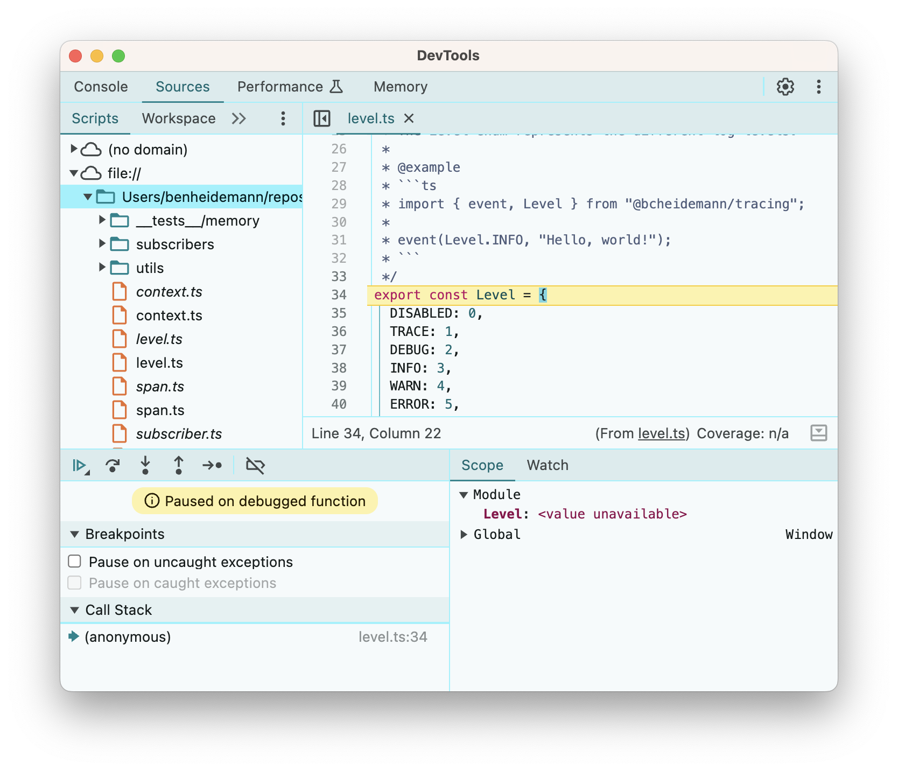
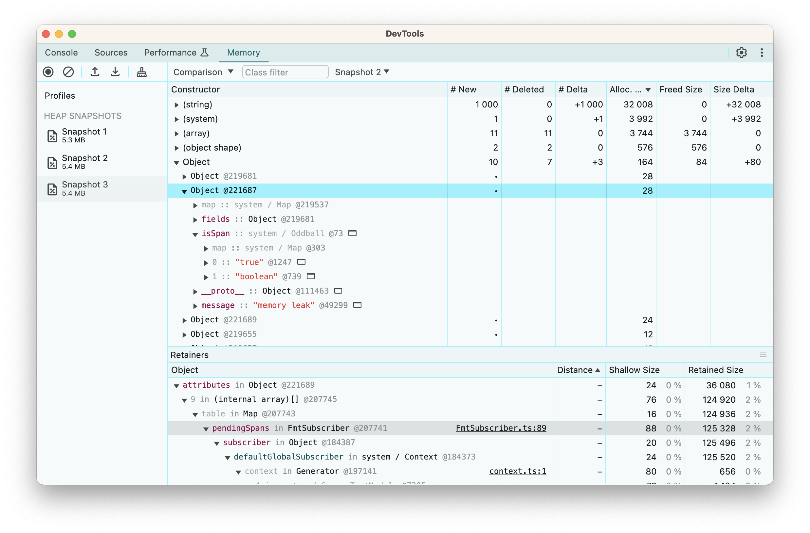
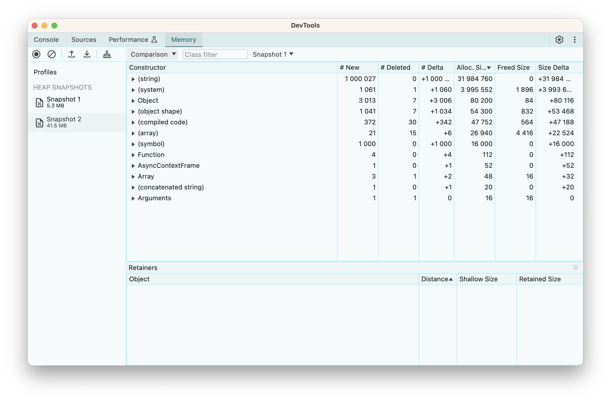

While working on [`@bcheidemann/tracing`](https://jsr.io/@bcheidemann/tracing), I had a suspicion that users might experience memory leaks under certain circumstances. This article documents the testing I carried out to confirm the leak, how I fixed it, and the steps I put in place to ensure they didn't resurface in future.

---

## Introduction

For the last month or so, I've been working on a new cross-runtime logging and observability library, inspired by the excellent Rust crate [tracing](https://docs.rs/tracing/latest/tracing/). It's been an exciting project to work on, and I've recently [published it to JSR](https://jsr.io/@bcheidemann/tracing). However, while working on it, I became concerned that there may be a corner case in one of the components which would cause a memory leak. This is obviously not acceptable for a logging library, so I started digging deeper.

## Understanding the Architecture

To understand how the leak arises, we first need to understand the libraries architecture. It is split into two main components: subscribers and application code. The application code emits logging and ovservability information. This information is then sent to the current registered subscriber, which can handle this information however it sees fit (usually by logging it).

There are two types of information a subscriber can receive from your application: spans and events. Events represent something which happened at a single point in time. They are equivalent to a `console.log` call. Spans, however, represent a *span* in time, such as the lifetime of a request, during which your application may emit logs relating to that span.

Ideally, we want the events emitted by the application to be associated with the spans, so that we can log "xyz happened *during* this span". Normally, to achieve this, our application would need to manually pass around some information about the current context. The ability to automatically consolidate events with spans is one of the USPs of both the [tracing crate](https://docs.rs/tracing/latest/tracing/) and this library.

## The Span Lifecycle & The Managed Subscriber

The lifecycle of a span is as follows:

1. The span is created -> current subscriber is notified and returns a span ID
2. The span is entered -> current subscriber is notified that the span ID has been entered
3. The span is exited -> current subscriber is notified that the span ID has been exited

The subscriber is also notified about events. But how does the subscriber know which events correspond to which spans?

If you're implementing the subscriber interface from scratch, this is up to you to figure out. However, tracing does provide a `ManagedSubscriber` class which can be extended to create your own custom subscriber, and handles span tracking automatically. It works like this:

1. The span is created -> the span and its ID are added to a map of pending spans
2. The span is entered -> the span is retrieved via its ID, and set as the current span (the previous entered span is recorded as its parent)
3. The span is exited -> the current spans parent span is set as the new current span

## The (Suspected) Leak

There are two cases when this can leak memory.

### Forever Spans

The first, somewhat unavoidable case, is if the span is never exited. Since this is a bug in the application code, we can't detect this. Thankfully though, there's several ways we can mitigate the risk of this happening.

First, entered spans act as resources under the [Stage 3 Explicit Resource Management proposal](https://github.com/tc39/proposal-explicit-resource-management), which has been [implemented in TypeScript since version 5.2](https://www.typescriptlang.org/docs/handbook/release-notes/typescript-5-2.html#using-declarations-and-explicit-resource-management). Therefore, if you use `using guard = span(...).enter()`, you don't need to remember to call `guard.exit()`; it will be called automatically at the end of the current scope, come rain or shine, uncaught exception or early return. Although it's possible to enter a span without using a `using` declaration, the [ESLint plugin](https://jsr.io/@bcheidemann/tracing-eslint) will flag this and suggest to use the `using` syntax instead.

The second mechanism to address this is instrumentation, another USP of the library. When instrumenting a function or a method, it will ([among other things](https://jsr.io/@bcheidemann/tracing#instrumenting-methods-and-functions)) ensure that spans created during the scope of that function or method are cleaned up after execution has finished. If you have instrumented a function (e.g. the request handler in your web server), your program will not leak memory beyond the scope of the instrumented function.

Lastly, if you do none of the above, your logs will look something like this:

```
[INFO] leaky span: Some log message
[INFO] leaky span:leaky span: Some log message
[INFO] leaky span:leaky span:leaky span: Some log message
[INFO] leaky span:leaky span:leaky span:leaky span: Some log message
[INFO] leaky span:leaky span:leaky span:leaky span:leaky span: Some log message
[INFO] leaky span:leaky span:leaky span:leaky span:leaky span:leaky span: Some log message
[INFO] leaky span:leaky span:leaky span:leaky span:leaky span:leaky span:leaky span: Some log message
[INFO] leaky span:leaky span:leaky span:leaky span:leaky span:leaky span:leaky span:leaky span: Some log message
[INFO] leaky span:leaky span:leaky span:leaky span:leaky span:leaky span:leaky span:leaky span:leaky span: Some log message
```

It's not ideal, but it should at least be obvious that you've forgotten to exit a span somewhere.

*If you have an idea for how we can avoid this issue, please [raise an issue in GitHub](https://github.com/bcheidemann/tracing-js/issues)!*

### Phantom Spans

It's possible to create a span, but to never enter it. Consider the following code:

```ts
function leak() {
  span(Level.INFO, "memory leak", { ... });
}

function createMemoryLeak() {
  setInterval(leak);
}
```

Because the managed subscriber enters created spans into a map at the time of creation (not entry), the unentered span will be indefinetly tracked by the subscriber. Each time `leak` is called, a new instance of the span is created and tracked by the subscriber.

You might ask, why would I choose to create spans and not immediately enter them? There's a few reasons for this, but one example would be to avoid incurring the cost of span creation on every function invocation. This may be relevant in performance sensitive applications or in hot paths. Consider the following:

```ts
function handleRequest(request) {
  using _guard = span(Level.INFO, "request").enter();

  // Do stuff
}
```

Here, the span is created on every request. If necessary, we can optimise this as follows:

```ts
const requestSpan = span(Level.INFO, "request");

function handleRequest(request) {
  using _guard = requestSpan.enter();

  // Do stuff
}
```

It's worth noting that this library is not really intended for high performance use cases. Don't get me wrong, it does perform well. But if the creation of a span object is the bottleneck of your program, then it's probably not for you. Also worth noting, is that at the time of writing, the library is still pre 1.0. I may still decide to deprecate the `enter()` method in favour of automatically entering spans when they are created.

## Investigation

My analysis of this memory leak has been largely theoretical up until now. I'm pretty confident in my assessment of the code, but it's always good to confirm this empirically. We'll start by confirming there actually *is* a leak, and then we'll confirm the source.

### Confirming the Leak

I wrote a simple program which I expected to leak if my intuition was correct:

```ts
import { Level, span, FmtSubscriber } from "@bcheidemann/tracing";

// 1. Create a large object
const SOME_LARGE_OBJECT: Record<string, string> = {};
for (let i = 0; i < 1000; i++) {
  const key = Math.random().toString();
  const value = Math.random().toString();
  SOME_LARGE_OBJECT[key] = value;
}

function leak() {
  // 2. Create a span with the large object but don't enter it
  span(Level.INFO, "memory leak", structuredClone(SOME_LARGE_OBJECT));
}

function createMemoryLeak() {
  // 3. Create the span repeatedly so we can observe the heap memory usage increase
  setInterval(leak);
}

// 4. Start the loop
FmtSubscriber.setGlobalDefault();
createMemoryLeak();

// 5. Periodically log the heap usage in MB
setInterval(() => {
  Deno.memoryUsage()
  console.log('heapUsed: ', Deno.memoryUsage().heapUsed / 1_000_000);
}, 1_000);
```

As expected, we see the heap memory climb up to the hundreds of MB within seconds:

```sh
$ deno run leak.ts
heapUsed:  19.85788
heapUsed:  33.781556
heapUsed:  48.449756
heapUsed:  62.108704
heapUsed:  77.905932
heapUsed:  92.79078
heapUsed:  107.829712
heapUsed:  121.57524
heapUsed:  135.751136
heapUsed:  150.287968
heapUsed:  164.642956
heapUsed:  178.769152
heapUsed:  192.983376
heapUsed:  205.432548
heapUsed:  220.066108
heapUsed:  234.995008
heapUsed:  249.183524
heapUsed:  263.887756
```

This looks pretty damming, but it's *possible* (if very unlikely) that the GC is just being lazy. We can confirm this by passing the `-expose_gc` flag to V8 and calling `gc()` to force a grabage collection cycle before checking the heap statistics. In Deno, you can pass V8 flags like this: `deno run --v8-flags=-expose_gc <file>`. Sure enough, on re-running the program we see the same results.

At this point, I'm pretty certain there is a memory leak somewhere in this program, but we still need to confirm *where* it is.

### Catching the Culprit

Since Deno supports the [V8 Inspector Protocol](https://v8.dev/docs/inspector), we can start our program with the `--inspect-brk` flag and then attach the chrome debugger by going to `chrome://inspect` in the browser and selecting our Deno process.



Now that we have the debugger attached, we can set a breakpoint on the first line of our leak function and watch how the memory profile changes between heap snapshots.

Comparing consecutive heap snapshots, we can see the addition of a new span object.



It isn't necessarily surprising to see this object in memory, as we'd expect a new object to be created on each call even without a memory leak. However, since V8 runs a GC cycle before taking a heap snapshot, and there shouldn't be anything retaining a reference to this object, we would expect it to have been removed from the heap.

To confirm that we are actually leaking memory and not just holding onto references longer than expected, let's add a counter :

```ts
let i = 0;
function leak() {
  // 2. Create a span with the large object but don't enter it
  span(Level.INFO, "memory leak", structuredClone(SOME_LARGE_OBJECT));
  i++;
}
```

This let's us add a conditional breakpoint. With the condition `i%1000 === 0` we can pause execution on every thousand iterations.



We can immediately see that we have about a thousand new symbols, presumably relating to the thousand spans that were created, and 1 million new strings, which likely correspond to the strings created by cloning `SOME_LARGE_OBJECT` a thousand times.

If we inspect either the symbols, strings or objects which have been created, we can see that they are retained via a reference from the `pendingSpans` map in our `FmtSubscriber` class. This effectively confirms our hypothesis that spans are being leaked due to a strong reference from the pending spans map.

## Fixing the Leak

Fixing the leak is relatively straightforward. Since our subscriber doesn't do anything with the span unless prompted to by our application code, it doesn't need to retain a strong reference to it. Changing our `Map` to a `WeakMap` allows the span ID to be collected, and if the span ID is collected, the span will also be collected.

The only gotcha here is due to the implementation of the managed subscribers `clone` method. A subscriber needs to be able to clone itself to enable concurrent asynchronous contexts without cross contamination (i.e. a span entered in one concurrent context should not necessarily be entered in another concurrent context).

The current implementation clones the map of pending spans. However, this is not possible with weak maps as you cannot enumerate it's entries. The first workaround which came to mind was to create a tree, in which each subscriber node retained a reference to its parents. When we need to find a pending span, we could walk the tree until we find it. However, since the span IDs are unique symbols, we don't need to worry about key collisions or keeping the pending span maps separate. Therefore, we can just clone the reference to the map, and share a single pending span map between all subscribers in the tree. This avoids a costly tree walk, and since the amortized* time complexity of both lookups and insertions in a hash map is O(1), we don't need to worry about keeping our maps small.

**To amortize something means to pay off its initial cost over a period of time. Amortized time complexity effectively means the average time complexity as we tend to infinitiy. For a hash map, the worst case time complexity for insertion and lookup is actually O(N), but as N (the size of the map) tends to infinity, the lookup and insertion time averages out to O(1).*

Although in theory, these changes should not change the behaviour of the library, it's still good to confirm this. Thankfully, we have a comprehensive set of unit tests, so we can make these kinds of internal refactors with fairly high confidence that we haven't broken anything. The change itself took less than 5 minutes to make, and re-running our `leak.ts` confirmed that the memory leak was in fact fixed.

## Preventing Future Leaks

In order to ensure that this, or similar memory leaks don't recur in future, even as we refactor the internal implementation, we need to add tests to assert the behaviour (in this case the abscence of leaks). This isn't completely trivial, as normally tests share heap memory with other concurrently running tests, and this could cause an assertion on heap memory to fail even when there is no leak. Ideally, we would run our tests in a separate, isolated Deno instance. Thankfully, this isn't my first rodeo with running tests in isolated Deno instances, having done so a couple years ago while contributing snapshot testing to the Deno standard library, and I have also [published a library to JSR](https://jsr.io/@bcheidemann/deno-isolated-test-case) which somewhat improves the DX for running tests in an isolated Deno context.

Therefore, we can pretty much copy our leaky code from earlier into our test case, and add some assertions to it. That ends up looking something like this:

```ts
import { isolatedTestCase } from "@bcheidemann/deno-isolated-test-case";
import { ManagedSubscriber } from "../../subscriber.ts";
import { span } from "../../span.ts";
import { Level } from "../../level.ts";
import {
  createSubscriberContext,
  setDefaultGlobalSubscriber,
} from "../../context.ts";
import { assertLess } from "@std/assert";

isolatedTestCase(
  "ManagedSubscriber should not leak memory due to unused spans",
  () => {
    // Arrange
    class ManagedSubscriberImpl extends ManagedSubscriber {
      protected onEvent(): void {
        // No-op
      }

      public static setGlobalDefault(): ManagedSubscriberImpl {
        const subscriber = new ManagedSubscriberImpl(Level.DISABLED);
        setDefaultGlobalSubscriber(createSubscriberContext(subscriber));
        return subscriber;
      }
    }
    ManagedSubscriberImpl.setGlobalDefault();
    // Arrange
    const SOME_LARGE_OBJECT: Record<string, string> = {};
    for (let i = 0; i < 1000; i++) {
      const key = Math.random().toString();
      const value = Math.random().toString();
      SOME_LARGE_OBJECT[key] = value;
    }
    function leak() {
      span(Level.INFO, "memory leak", structuredClone(SOME_LARGE_OBJECT));
    }
    leak();
    for (let i = 0; i < 1_000; i++) {
      leak();
    }
    // @ts-ignore -- V8 expose GC flag is enabled
    gc();
    const initialHeapTotal = Deno.memoryUsage().heapTotal;

    // Act
    for (let i = 0; i < 5_000; i++) {
      leak();
    }

    // Assert
    // @ts-ignore -- V8 expose GC flag is enabled
    gc();
    const heapIncrease = Deno.memoryUsage().heapTotal - initialHeapTotal;
    assertLess(heapIncrease, 10_000_000);
  },
  {
    denoFlags: ["--v8-flags=-expose_gc"],
  },
);
```

A quick checkout of the previous version of our `ManagedSubscriber.ts` file and a re-run of the tests confirms that the memory leak would have been caught by this test.

## Conclusion

I know there's plenty of articles out there on debugging memory leaks in JavaScript applications, but I found very few practical hands-on examples with a public codebase. My hope therefore, is that this article is useful to anyone looking for a real world example of fixing a memory leak that they can actually follow along with. To that end, if you want to check out the leaky code, the last commit at which the leak was present is [`2f3ca62b013b945187ea54c4bae88901a44c2f93`](https://github.com/bcheidemann/tracing-js/blob/2f3ca62b013b945187ea54c4bae88901a44c2f93/src/subscribers/ManagedSubscriber.ts) - you'll see a comment on [line 45](https://github.com/bcheidemann/tracing-js/blob/2f3ca62b013b945187ea54c4bae88901a44c2f93/src/subscribers/ManagedSubscriber.ts#L45-L47) inidcating the leak and the proposed solution which, as discussed above, differs slightly from the final implementation, which you can find at commit [`186d33e722618bc699c67edded5bd7fe0f989efd`](https://github.com/bcheidemann/tracing-js/blob/186d33e722618bc699c67edded5bd7fe0f989efd/src/subscribers/ManagedSubscriber.ts).
