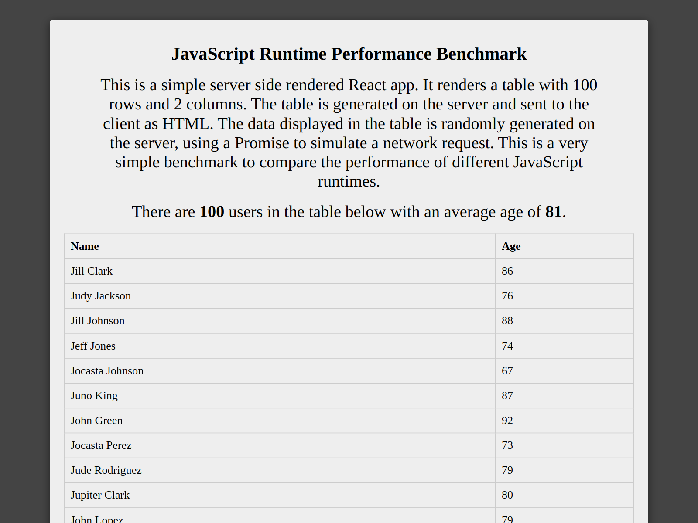

Recently, the [Bun JavaScript runtime](https://bun.sh/) has hit version 1.0, boasting several impressive performance benchmarks. Furthermore, [Deno](https://deno.com/) has made great strides in becoming a drop in replacement for [Node.js](https://nodejs.org/). In light of this, I felt it was time to conduct Node vs Deno vs Bun benchmark.

---

## Introduction

Recently, the [Bun JavaScript runtime](https://bun.sh/) has hit version 1.0, boasting several impressive performance benchmarks. It also claims to be a drop in replacement for [Node.js](https://nodejs.org/), the current defacto server side JavaScript runtime. However, the benchmarks showcased on the Bun website utilise Bun specific APIs, leaving questions over its performance benefits as a true drop-in replacement. Furthermore, [Deno](https://deno.com/) has made great strides in becoming a drop in replacement for Node.js since it's 1.0 release. While not having performance as its primary goal, Deno does take performance seriously, and actively [tracks its performance publicly](https://deno.com/benchmarks).

This article evaluates the performance of Bun and Deno as true drop-in replacements for Node.js by running a performance benchmark against an idiomatic Node.js web application. This application aims to be as realistic as possible and use no Deno or Bun specific APIs. The aim is to determine if there is value in switching to one of these two runtimes for existing projects without first undergoing significant refactoring.

## Approach

It was important to make this benchmark as realistic as possible, utilizing industry standard libraries from the Node.js ecosystem. A simple server rendered [React](https://react.dev/) app was created, serving a single route using [Express](https://expressjs.com/). Since server rendering typically involves some form of data retrieval, the app read data from a [Planetscale](https://planetscale.com/) MySQL database using [Drizzle ORM](https://orm.drizzle.team/). This data was used to render a table of 100 users and their ages.

To simulate a realistic deployment environment and to ensure consistency, the app was deployed to a [Linode](https://www.linode.com/) dedicated instance with 4GB RAM and 2 CPUs. Load was then simulated using [Oha](https://github.com/hatoo/oha). To ensure that all runtimes had a chance to optimize hot code paths, the application was subjected to a 30 second warm up load before measurement. This was found to be sufficient to allow each runtime to reach a stable response time. Following the warm up load, a 60s load test was conducted and performance statistics were collected. This test was carried out twice, once with 50 workers, and again with 500 workers.

Before running the code, it was transpiled, bundled and minified (but not mangled) using [esbuild](https://esbuild.github.io/). Node modules were excluded from the bundle.

## Implementation

The below is a screenshot of the benchmark application, followed by the relevant source code. The full source code can be found on [GitHub](https://github.com/bcheidemann/js-runtime-benchmark).



```tsx
import React from 'react';
import { renderToString } from 'react-dom/server';
import express from 'express';

import { db } from './database/client.ts';
import { UsersTable } from './database/schema.ts';

async function Table() {
  const userRecords = await db
    .select()
    .from(UsersTable)
    .limit(100)
    .execute();
  
  const users = userRecords.map((user) => ({
    id: user.id,
    name: user.firstName + ' ' + user.lastName,
    age: (new Date().getTime() - new Date(user.dateOfBirth!).getTime()) / 1000 / 60 / 60 / 24 / 365,
  }));

  return (
    <>
      <p>
        There are <b>{userRecords.length}</b> users in the table below with an average age of{' '}
        <b>{Math.round(users.reduce((sum, user) => sum + user.age, 0) / userRecords.length)}</b>.
      </p>
      <table style={{ width: '100%', textAlign: 'left' }}>
        <thead>
          <tr>
            <th>Name</th>
            <th>Age</th>
          </tr>
        </thead>
        <tbody>
          {users.map((user) => (
            <tr key={user.id}>
              <td>{user.name}</td>
              <td>{Math.floor(user.age)}</td>
            </tr>
          ))}
        </tbody>
      </table>
    </>
  );
}

const app = express();

app.get('/', async (req, res) => {
  const html = renderToString(
    <html>
      <head>
        <title>Javascript Runtime Benchmark</title>
        <meta charSet='utf-8'></meta>
        <style>
          {`
            table {
              border-collapse: collapse;
              border: 1px solid #ccc;
            }
            th, td {
              border: 1px solid #ccc;
              padding: 8px;
            }
            body {
              background-color: #444;
              padding: 20px;
            }
          `}
        </style>
      </head>
      <body>
        <main style={{
          margin: '0 auto',
          maxWidth: '800px',
          padding: '20px',
          backgroundColor: '#eee',
          borderRadius: '4px',
          textAlign: 'center',
          boxShadow: 'rgba(0, 0, 0, 0.5) 0px 3px 12px',
        }}>
          <h1 style={{ fontSize: '20px' }}>JavaScript Runtime Performance Benchmark</h1>
          <p style={{ fontSize: '16px', padding: '0 40px' }}>
            This is a simple server side rendered React app.
            It renders a table with 100 rows and 2 columns.
            The table is generated on the server and sent to
            the client as HTML. The data displayed in the table
            is randomly generated on the server, using a Promise
            to simulate a network request. This is a very simple
            benchmark to compare the performance of different
            JavaScript runtimes.
          </p>
          {await Table()}
        </main>
      </body>
    </html>
  );
  res.send(html);
});

app.listen(3000, () => console.log('Listening on http://0.0.0.0:3000'));
```

Garbage collection was identified as being a potential differentiator between the runtimes, with Node and Deno using a different JavaScript engine ([v8](https://v8.dev/)) than Bun (which uses [JavaScriptCore](https://developer.apple.com/documentation/javascriptcore)). For this reason, the application was designed to produce garbage in a way that is typical for React applications. This was done by mapping over the user records, calculating their age from the date of birth column. The relevant code is highlighted below.

```tsx
  const userRecords = await db
    .select()
    .from(UsersTable)
    .limit(100)
    .execute();

  const users = userRecords.map((user) => ({
    id: user.id,
    name: user.firstName + ' ' + user.lastName,
    age: (new Date().getTime() - new Date(user.dateOfBirth!).getTime()) / 1000 / 60 / 60 / 24 / 365,
  }));
```

## Results

### 50 Workers


### 500 Workers


## Discussion

### Results

Under a normal load (50 workers), Bun was found to perform best across all metrics. This was followed by Deno, with Node.js having the worst performance of the evaluated runtimes. These differences were statistically significant. Although no threshold was determined for real world significance, the performance differences between the benchmarks are likely to be considered significant in the context of most applications.

When the number of workers was increased to 500, the ranking of the frameworks on the requests per second metric remained the same, with Bun serving the most requests per second, and Node.js the fewest. However, Node.js was found to have the lowest response time up to the 95% percentile, with Deno and Bun having similar performance to each other. In contrast, the Node.js metrics for response time in the 99th 99.9th and 99.99th percentile, was substantially higher than both Deno and Bun, with it spiking up to 12 seconds at the 99th percentile, and as high as 59 seconds in the 99.99th percentile.

Despite this spike, the average and lowest response times for Node.js were lower than both Deno and Node, with Bun having a slightly faster average response time than Deno, and a significantly lower lowest response time.

Overall, Deno and Bun were found to have more consistent performance in terms of response time, and were able to serve more requests per second than Node.js. However, at high loads, Node.js is able to serve requests with lower average latency. These results indicate that switching to Deno or Bun may have a positive impact on hosting costs, provided that resource utilization is comparable. Additionally, Deno and Bun would yield a better end user experience at moderate loads, due to them being capable of serving requests with lower latency.

### Limitations

1. This benchmark primarily focuses on server rendered UIs. This means the results are not necessarily applicable to all use cases. This article does not aim to provide a ubiquitous benchmark, and it is important to conduct proper benchmarking before making performance oriented changes in production.
2. The performance of metaframeworks like [Next.js](https://nextjs.org/) was not evaluated. These are arguably the most common way to do server side rendering in production for non-legacy applications. These were not considered for this benchmark because at present [Next.js cannot trivially be run with Deno](https://github.com/vercel/next.js/discussions/26428) making a fair benchmark difficult. Note that the Deno team are actively working on this and [are aiming for support in Q1 of 2024](https://github.com/denoland/deno/issues/17807).
3. Memory and CPU usage were not recorded. This makes it difficult to draw conclusions about how each runtime will scale, or how the performance characteristics would change in a more resource constrained environment. This makes it difficult to draw conclusions about the impact on the real world cost of hosting web applications using each framework, since it's possible that Deno and Bun performed better due to utilizing more resources.
4. The simulated load was not realistic in several ways. Ideally, real world load would have been recorded and then replayed. However, since the benchmark application was developed and deployed specifically for this benchmark, this was not possible.
5. There was some minor changes made to support each runtime. Some of these were minor changes, such as checking for the presence of the Node.js `process` global before loading environment variables. Others had potentially significant implications to real applications. For example, the source code was compiled to ES Modules syntax in order to support Deno, and was bundled into a single file to sidestep the differences in module resolution between the runtimes.

## Conclusion

Based on these benchmark results, switching runtime from Node.js to Deno or Bun would yield significant performance improvements in both requests per second and response times, while also yielding more consistent performance. Very minimal changes to the application source code were required allow the application to run across all runtimes. This enables developers to take advantage of the performance benefits with relatively low risk, since they can easily switch back to Node.js.

## Links

- [Benchmark Source (GitHub)](https://github.com/bcheidemann/js-runtime-benchmark)

## Appendix

### Raw Data - 50 Workers

| Runtime | Req/s    |
| ------- | -------- |
| Node    | 209.8815 |
| Deno    | 276.0591 |
| Bun     | 347.0555 |

| Runtime | Slowest | Fastest | Average |
| ------- | ------- | ------- | ------- |
| Node    | 2.0525  | 0.1749  | 0.2378  |
| Deno    | 1.2845  | 0.054   | 0.1808  |
| Bun     | 0.45    | 0.0405  | 0.1439  |

| Percentile | Node   | Deno   | Bun    |
| ---------- | ------ | ------ | ------ |
| 10         | 0.205  | 0.1463 | 0.1006 |
| 25         | 0.2157 | 0.1619 | 0.1111 |
| 50         | 0.2327 | 0.1803 | 0.1283 |
| 75         | 0.2508 | 0.1981 | 0.1621 |
| 90         | 0.27   | 0.218  | 0.2234 |
| 95         | 0.2853 | 0.2324 | 0.2328 |
| 99         | 0.3366 | 0.2663 | 0.2484 |
| 99.9       | 0.7095 | 0.3595 | 0.2649 |
| 99.99      | 1.9395 | 0.4277 | 0.299  |

### Raw Data - 500 Workers

| Runtime | Req/s    |
| ------- | -------- |
| Node    | 207.7633 |
| Deno    | 253.3093 |
| Bun     | 297.3276 |

| Runtime | Slowest | Fastest | Average |
| ------- | ------- | ------- | ------- |
| Node    | 59.4963 | 0.0402  | 1.1007  |
| Deno    | 3.5783  | 0.1689  | 1.9409  |
| Bun     | 3.1352  | 0.0553  | 1.6546  |

| Percentile | Node    | Deno   | Bun    |
| ---------- | ------- | ------ | ------ |
| 10         | 0.3929  | 1.8716 | 1.0723 |
| 25         | 0.5957  | 1.9194 | 1.4754 |
| 50         | 0.7929  | 1.9567 | 1.6272 |
| 75         | 0.944   | 2.0021 | 1.7733 |
| 90         | 1.0357  | 2.049  | 2.3518 |
| 95         | 1.0875  | 2.093  | 2.6013 |
| 99         | 12.0869 | 2.5692 | 2.8396 |
| 99.9       | 54.2449 | 3.456  | 2.9298 |
| 99.99      | 58.9672 | 3.5783 | 2.9808 |
