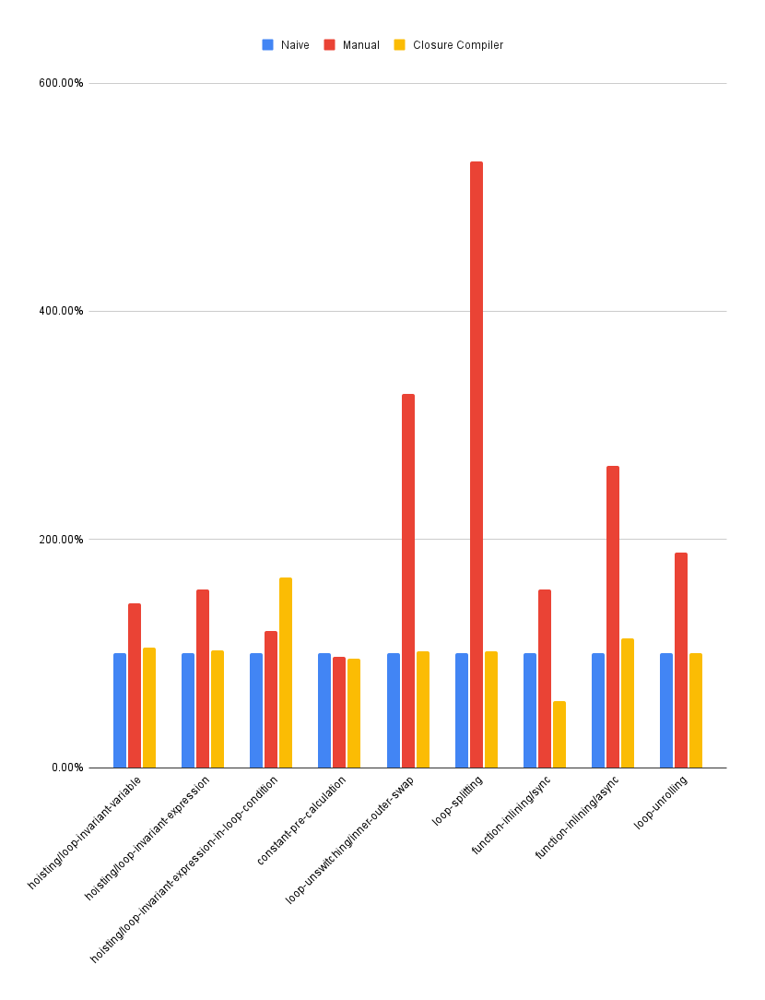

Optimising compilers (like [Clang](https://clang.llvm.org/)/[LLVM](https://llvm.org/) or [GCC](https://gcc.gnu.org/)) have developed amazingly sophisticated methods for re-writing code that is optimized for readability into code that is optimized for performance. These are standard tools in the compiled language space, but are rarely used in the web. In this article, we discuss whether it's worth re-visiting optimising compilers for the web, and what performance benefits potentially remain untapped.

---

## Introduction

Recently, the React team has open-sourced the [React Compiler](https://react.dev/learn/react-compiler). This compiler optimizes your React code, and the team at Meta have seen impressive results when applying this to production codebases such as Instagram. This got me thinking, why is this the first optimising compiler I've heard of in the JS ecosystem since the [Closure Compiler](https://developers.google.com/closure/compiler)? Sure we have minifiers in abundance, type strippers galore, but remarkably few optimising compilers.

To answer this question, I googled "optimising compilers JavaScript". After all, maybe this is just a blind spot for me. I found a few interesting results, such as [this interesting attempt to use LLVM on JS code](https://labs.leaningtech.com/blog/a-javascript-optimising-compiler), and [Prepack](https://prepack.io/), which focuses mostly on detecting and pre-calculating compile time constants, and of course the [Closure Compiler](https://developers.google.com/closure/compiler). I also found some Reddit posts...

## A Review of Reddit

There were some interesting takes on optimising compilers for JavaScript/TypeScript on Reddit... Takes like:

> Because JavaScript is a high-level language that is highly optimized by the runtime’s JIT compiler, applying traditional compiler optimizations at the JavaScript source code level isn’t necessarily worth it.
> [(source)](https://www.reddit.com/r/typescript/comments/hh1rdt/any_optimizing_compilers_yet_like_the_closure/)

And also:

> These things [function inlining, and loop unrolling] work in a traditional programming environment, but would be detrimental in many Typescript projects.
> [(source)](https://www.reddit.com/r/typescript/comments/hh1rdt/any_optimizing_compilers_yet_like_the_closure/)

Of course, neither factiod is substantaited with evidence. But, the point about the JIT compiler does at least *sound* plausible.

So lets test it!

## Method

I put together some benchmark tests for common optimising compiler use cases like loop unrolling, function inlining, and several more. Each test case consisted of 3 benchmarks: the naive implementation, the manually applied optimisation, and a version optimised by the [Closure Compiler](https://developers.google.com/closure/compiler).

Each benchmark was repeated over 16M times per iteration to ensure that the V8 optimising compiler would have time to work its magic too. This way, we can test the claim that "optimizations at the JavaScript source code level [aren't] necessarily worth it" due to the JIT compiler.

## Results

|                                                      | Rate (iter/s) |            |                      | Rate (normalised) |                |                      |
|------------------------------------------------------|---------------|------------|----------------------|-------------------|----------------|----------------------|
| **Optimisation**                                     | **Naive**     | **Manual** | **Closure Compiler** | **Naive**         | **Manual**     | **Closure Compiler** |
| hoisting/loop-invariant-variable                     |         _9.7_ |       _14_ |               _10.2_ |               _1_ |  _1.443298969_ |        _1.051546392_ |
| hoisting/loop-invariant-expression                   |        _10.2_ |     _15.9_ |               _10.5_ |               _1_ |  _1.558823529_ |        _1.029411765_ |
| hoisting/loop-invariant-expression-in-loop-condition |        _28.7_ |     _34.3_ |               _47.8_ |               _1_ |  _1.195121951_ |        _1.665505226_ |
| constant-pre-calculation                             |        _12.4_ |       _12_ |               _11.8_ |               _1_ | _0.9677419355_ |       _0.9516129032_ |
| loop-unswitching/inner-outer-swap                    |        _46.2_ |    _151.3_ |                 _47_ |               _1_ |  _3.274891775_ |        _1.017316017_ |
| loop-splitting                                       |        _28.3_ |    _150.4_ |               _28.8_ |               _1_ |  _5.314487633_ |        _1.017667845_ |
| function-inlining/sync                               |        _54.2_ |     _84.7_ |               _31.6_ |               _1_ |  _1.562730627_ |       _0.5830258303_ |
| function-inlining/async                              |         _4.5_ |     _11.9_ |                _5.1_ |               _1_ |  _2.644444444_ |        _1.133333333_ |
| loop-unrolling                                       |        _22.4_ |     _42.2_ |               _22.5_ |               _1_ |  _1.883928571_ |        _1.004464286_ |

## Discussion

We can see from the results that in most cases the [Closure Compiler](https://developers.google.com/closure/compiler) produces minimal performance improvements, and even results in significant performance degradation on one of the benchmarks. Although there is some benefit observed in these benchmarks, these are unlikely to warrent complicating your build pipeline for most commerical projects, which explains why the [Closure Compiler](https://developers.google.com/closure/compiler) is rarely seen in the wild.

However, we find that the manually applied optimisations result in significant performance improvements on all but one benchmark. Furthermore, on three of the benchmarks it shows a greater than 200% speed improvment.

The synchronous function inlining optimisation is an interesting example, as it shows a rare case where an optimising compiler has a negative impact on performance. Iterestingly, the fast hand optimised code and the slow [Closure Compiler](https://developers.google.com/closure/compiler) optimised code are identical in all but one way. This difference is that in addition to inlining the function, the [Closure Compiler](https://developers.google.com/closure/compiler) has also mirrored the expression in the function, converting `i % 2 === 0` to `0 === i % 2`.

It's not clear why the [Closure Compiler](https://developers.google.com/closure/compiler) would apply such a transformation, nor why this would have any performance impact. Perhaps it is because past versions of V8 were more efficient at applying strict equality operations when the left-hand side was a constant. In my experience, it is far more common for people to write the constant on the right-hand side of the expression, so it's possible that the V8 team decided to optimise for this use case instead.

We investigated only a subset of 

It should be noted that such isolated benchmarks are not representative of production applications, so it's possible we would observer different results on more realisting programs. We also only investigated a small subset of the optimisation techniques that are available to modern optimising copilers. However, with the magnitude of the performance improvements achieved, it seems that further research into the impact of JavaScript to JavaScript optimising compilers would be worthwhile. This should focus on testing these techniques against more complex codebases, and exploring additional optimisation techiques.

Such research could be very impactful, as there are several possible applications for such compilers. One example is on the front-end, where frameworks like [React](https://react.dev/) will have high workloads to render or hydrate the UI on page load. Since the V8 compiler will only apply optimisations to hot functions, this means the initial rendering or hydration of a page may suffer from executing slower unoptimised bytecode. According to comments made by V8 developers, in some circumstances it may take as many as 10k invocations of a function before it is optimised.

Another example where compile time optimisations may be useful are in so-called serverless applications. It is increasingly common to deploy so called serverless applications to tiny virtual servers, which are automatically horizontally scaled up and down in accordance with demand. This practice results in a phenomenon known as "cold starts", where a new instance of the application is started to handle an increase in demand. In such cases, fast startup is essential, as requests may idle until the new application instance is ready to handle them. Application frameworks such as [NestJS](https://nestjs.com/) can add nearly an [additional 200ms](https://docs.nestjs.com/faq/serverless) to startup time compared to a raw Node.js script running on a MacBook Pro. The impact will likely be significantly higher for serverless applications, which may have as little as 128MB of memory and a single vCPU per instance.

It may also be worth exploring the kinds of optimisations which can be achieved by utilising type information. Most production code is implemented in TypeScript, and the TypeScript type checker can infer type information even from JavaScript files. Therefore, it may be possible to use type information to guide optimisation for JavaScript code which are not possible for lower level representation. For instance, some asynchronous functions do not make use of the async keyword and istead return promises. These can be detected using the TypeScript type checker, which can identify synchronous functions which return instances of the `Promise` class. Further research could be directed to identifying type-driven optimisations.

## Conclusion

JavaScript has benefited substantially from performance improvements in V8 and other engines. However, this research reveals that there may be substantial performance improvements which could be unlocked using an optimising JavaScript to JavaScript compiler. These have widespread application in both backend and frontend applications. Of particular interest are serverless JavaScript applications and client rendered frontend applications, as these are most likely to suffer from running code which is not yet optimised by the JavaScript engine. Future research is required to identify a wider range of techniques which can be effectively applied to JavaScript code, and to assess the real world impact of such optimisations on production applications.

## Links

- [Benchmark source code (GitHub)](https://github.com/bcheidemann/js-optimising-compiler-benchmarks)
