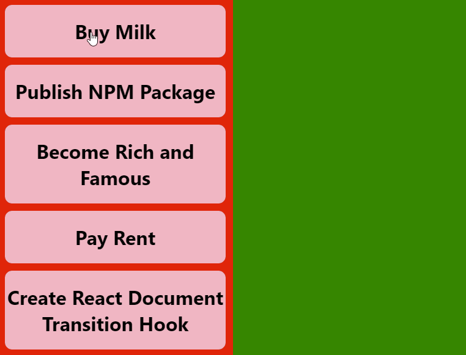

In November 2020, the [Web Incubator Community Group (WICG)](https://wicg.io/) proposed the [shared element API](https://github.com/WICG/shared-element-transitions). It has since been implemented by the Google Chrome team and is available behind a feature flag in [Chrome Canary](https://www.google.com/intl/en_uk/chrome/canary/). Naturally, I tried hacking this into a React hook...

---

## Introduction

If you don't know what this is about, I would stongly suggest to go watch [this video](https://www.youtube.com/watch?v=JCJUPJ_zDQ4) by [Jake Archibald](https://jakearchibald.com/) and the Google Chrome team. It explains what the API does and the fundamentals of how it works.

In summary, the proposal consists of a few different JavaScript and CSS APIs which enable to creation of arbitrary transition effects for page transitions, in both single-page and multi-page webapps. These are interesting because they allow developers to animate elements in and out, without having to manage complex state with JavaScript.

## The Basics

The main API we're interested in is the `document.createDocumentTransition` API. This can be used as follows:

```ts
let transition = document.createDocumentTransition();

await transition.start(async () => {
    await updateTheDom();
});
```

This, by default, will cause the whole page to be cross-faded. We can build upon this by telling the browser to individually track certain elements using CSS.

```css
.individually-tracked-element {
  page-transition-tag: individually-tracked-element;
}
```

These two features alone enable us to do some pretty fancy stuff. Check out this ToDo list animation:



There's plenty more to explore here, like custom CSS animations for transitions. In this post, I'll won't go into too much detail as I haven't fully explored all the possibilities yet.

---

## Creating a React Hook

I've recently been playing about with Svelte and SvelteKit, which make animations like the one above pretty easy. Since using Svelte, I have been wondering how I could implement something similar in React. So naturally, when I learned about this API, my first thought was "how can I integrate this with React state updates".

Turns out, that it's not too hard! This is the solution I came up with:

```ts
import { useState } from "react";
import { flushSync } from "react-dom";

export function useTransitionState(initialState) {
  const [state, setStateInternal] = useState(initialState);

  const setState = async (value) => {
    if (!document.createDocumentTransition) {
      return setStateInternal(value);
    }
    const transition = document.createDocumentTransition();
    flushSync(() => void(0));
    await transition.start(() => {
      flushSync(() => {
        setStateInternal(value);
      });
    });
  };

  return [state, setState];
}
```

This is essentially a thin wrapper around `React.useState`, and can be used in more or less the same way. By default, it will do a cross-fade when you call `setState`, but this behaviour can be fully customised with CSS.

You may have noticed the use of `flushSync`. This achieves two things. The first call, ensures that any queued state updates are immediately rendered to the DOM, ensuring that these are not accidentally animated. The second call, ensures that the state updates are immediately applied to the DOM, and not queued by React. This ensures that the state update will always be animated.

---

## Using the React Hook

So let's see how we might use this hook to create the above ToDo list:

```tsx
import { useTransitionState } from 'react-document-transition';
import './App.css';

type TodoItem = {
  name: string;
  done: boolean;
}

type TodoListState = {
  items: TodoItem[],
}

function Item(item: TodoItem & { toggle: (item: TodoItem) => void}) {
  const slug = item.name.replaceAll(" ", "-").toLowerCase();

  return (
    <div
      onClick={() => item.toggle(item)}
      className={`item ${item.done ? 'done' : ''}`}
      style={{
        pageTransitionTag: slug,
      } as React.CSSProperties}
    >
      <h1>{item.name}</h1>
    </div>
  );
}

function App() {
  const [state, setState] = useTransitionState<TodoListState>({
    items: [
      { done: false, name: "Buy Milk" },
      { done: false, name: "Publish NPM Package" },
      { done: false, name: "Become Rich and Famous" },
      { done: true, name: "Pay Rent" },
      { done: true, name: "Create React Document Transition Hook" },
    ],
  });

  function toggle(item: TodoItem) {
    let items: TodoItem[] = Array.from(state.items);

    const foundItem = items.find(maybeItem => maybeItem.name === item.name);
    if (foundItem) {
      foundItem.done = !foundItem.done;
    }
    
    setState({
      items,
    });
  }

  return (
    <div className="App">
      <div className="todo-col">
        {state.items.filter(item => !item.done).map((item) => (
          <Item {...item} toggle={toggle} key={item.name} />
        ))}
      </div>
      <div className="done-col">
        {state.items.filter(item => item.done).map((item) => (
          <Item {...item} toggle={toggle} key={item.name} />
        ))}
      </div>
    </div>
  );
}

export default App;
```

You will notice here, that of the 69 lines of code needed to implement this UI, only four lines are actually controlling the animation:

```tsx
const slug = item.name.replaceAll(" ", "-").toLowerCase();

// --snip--

style={{
  pageTransitionTag: slug,
} as React.CSSProperties}
```

This adds the `page-transition-css` property to the element, which enables Chrome to track the element, even when it is moved to a completely different branch in the DOM tree. Because Chrome knows how to track the element now, it will create a smooth transition between where it is remove and where it is added.

---

## How Can I Use This?

In case you want to try this out yourself, I have published the code as an NPM package. You can install it with:

```sh
npm install react-document-transition
```

I will be messing about with this package a lot over the next few days and I'm excited to see what new possibilities it opens up!

---

## Conclusion

It will likely be some time before this is shipped in all browsers so although `react-document-transition` gracefully degrades when the `createDocumentTransition` is unavailable, you probably won't get much mileage out of it for the time being. However, I've got my fingers firmly crossed that someone will release a polyfill for this soon!

Thanks for reading! 🥳

---
